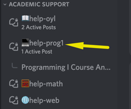

# Getting Help

<<<<<<< HEAD
If you have any trouble understanding the concepts or stuck on a problem, we expect you to reach out for help! Below are the different ways to get help in this class.

## channel #help-prog1

The first place to go is always the #help-prog1 channel. Share your question there so that me and your peers can help as soon as we can.

## Message me on Discord

If your question was not answered on time by me or your colleagues, you can message me directly on Discord. I'll try to answer as soon as I can.

## Office Hours

I will be holding weekly office hours on **Tuesdays 13:00 GMT**. It's an online Zoom meeting where we can chat about anything. I'll post the join link in the **#help-prog1 -> announcements** on the same day.
=======
If you have any trouble understanding the concepts or stuck on a problem, we 
expect you to reach out for help! 

Below are the different ways to get help in this class.

## Discord channel #help-prog1

The first place to go is always the #help-prog1 channel. Share your question 
there so that your Instructor and your peers can help as soon as we can.

## Message your instructor on Discord

If your question doesn't get resolved within 24 hours on Discord, you can 
reach out to your instructor directly via Discord DM.

## Office Hours

Office hours with Mohammed will be on **Tuesdays 13:00 GMT**.

It's an online Zoom meeting where we can chat about anything. 

The join link will be posted in the thread **#help-prog1 -> announcements** on the same day.
>>>>>>> main

# Tips on Asking For Help

When asking for help, include the following information:

1. Details of your goal.

   _"I am trying to [goal]."_

2. Details of what you have tried so far.

   _"I have tried [details of how you have tried to solve the problem already]."_

3. Helpful context.

   _“Here’s a screenshot of my code."_

**❌ Don’t Write**

- “need help”
- “I’m stuck on problem 3”
- “Can anyone help?”
- “Hi”

**✅ Do Write**

<<<<<<< HEAD
- “I’m working on solving problem three, and getting this error when I run my code: [screenshot]. Can anyone help explain this error? I don’t get it.”
- “I’m trying to print all the values in this list for my project, but it keeps saying `NameError: name ‘item’ is not defined`. Here's a screenshot of my code. I tried changing the list, but that didn't work."
=======
- “I’m working on solving problem three, and getting this error when I run my 
  code: [screenshot]. Can anyone help explain this error? I don’t get it.”
- “I’m trying to print all the values in this list for my project, but it keeps 
  saying `NameError: name ‘item’ is not defined`. Here's a screenshot of my 
  code. I tried changing the list, but that didn't work."
>>>>>>> main

## Screenshots

It’s often helpful to include a screenshot with your question. Here’s how:

- **Windows:** press the Windows key + Print Screen key
  - the screenshot will be saved to the Pictures > Screenshots folder
  - _alternatively: press the Windows key + Shift + S to open the snipping tool_
- **Mac:** press the Command key + Shift key + 4
  - it will save to your desktop, and show as a thumbnail

## Peer collaboration

You can work with your peers on exercises, and on some of the projects, as
specified in the project instructions.

When you work with a peer, be sure that you:

<<<<<<< HEAD
- Collaborate effectively: communicate with your peers about when you will meet
  and what you will do
- **Write code yourself**: do not just watch someone else solve the problem. You
  have to write lots of code in this course in order to succeed.
- Read and understand your peers' code: seeing how someone else solves a problem
=======
- **Collaborate effectively**: communicate with your peers about when you will meet
  and what you will do
- **Write code yourself**: do not just watch someone else solve the problem. You
  have to write lots of code in this course in order to succeed.
- **Read and understand your peers' code**: seeing how someone else solves a problem
>>>>>>> main
  can help you learn new techniques, or you might have a better technique to
  share with your partner. If there's something in their code you are confused
  by, _ask_
