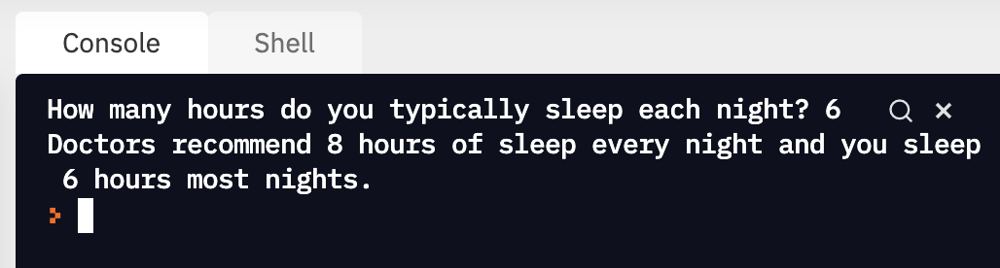

# Input and output

## Key ideas

- Show output with `print()`
- Get data from the user with `input()`

## Printing Output

Websites and apps you have used in the past have a whole screen full of text and buttons. Eventually, you’ll learn to build those kinds of programs, but we’re starting with the basics: programs that work with text.

`print` shows some output to the Console:

```python
print("Hello, world")
```

You’ve written code like this from your first “Hello, World” program. When you run it, the output shows up.

In Replit, output shows in the ‘Console’ tab. On early computers, there was _only_ a text console. On the earliest computers, there wasn’t a screen at all. Instead, the output was printed out on paper. The output now shows up in the Console in our web browser, but we still call the function `print`.

```python
print("We can print any string we want")
x = ("If the string is in a variable, we can print the variable")
print(x) # If the string is in a variable, we can print the variable
```

## Getting Input from the User

You've already used the `input()` function in earlier challenges to get the name from the user.

When Python sees `input`:

- It prints out the arguments to `input`, similar to `print`.
- It pauses to wait for the user to type something in
- It waits for the user to press Enter
- When the user presses Enter, `input` gives the program the text that the user typed in

We can design lots of text-based interactions using `input`. A calculator, a search engine, a quiz, a chatbot - all of these and more can be designed to use text input and output.

### Converting Inputs

The `input()` function returns a **string**. If you want a number, need to convert the data type using `int` or `float`.

```python
response = input("How old are you?")
age = int(response)
```

It’s common to see the input and the conversion all at once, like this:

```python
age = int(input("How old are you?"))
```

Converting to a float is similar:

```python
soda_price = float(input("How much does a soda cost?"))
```

<details>
<summary>What does python do if you try to convert a string like <code>"3.5"</code> to an integer using <code>int</code>?
</summary>

```python
int("3.5") # ValueError: invalid literal for int() with base 10: '3.5'
```

⚠️ Python doesn’t want to accidentally lose information. Instead of guessing whether you want to round up or down, it raises a `ValueError` and halts the program.

</details>

### Practice: Assigning and printing user input

<aside>

👩🏿‍💻 Let's practice assigning and printing user input. Modify the code below by following the directions in the **Instructions** tab.

</aside>

<div style="position: relative; padding-bottom: 56.25%; height: 0;"><iframe src="https://replit.com/team/kibo-fpwp6/W13-Input-Hours-of-Sleep" frameborder="0" webkitallowfullscreen mozallowfullscreen allowfullscreen style="position: absolute; top: 0; left: 0; width: 100%; height: 100%;"></iframe></div>

<aside>

📌 Here's what the output should look like when you run the program



</aside>

## Experimenting With Print

```python
print()
print
print("Hello", "world")
```

What happens when there’s nothing between the parentheses? Or if you leave off the parentheses? Or if you put more than one thing between the parentheses?

Sometimes, the best way to find things out about how Python works is to try it out.

> **Experiment with `print` to find out what it does in different situations**
>
> [https://replit.com/@kibocurriculum/Explore-With-Print](https://replit.com/@kibocurriculum/Explore-With-Print)

## Print with multiple arguments

The `print()` function can take more than one argument. It can have more than one thing inside the parentheses `(...)`

However, you must separate arguments by commas.

```python
name = "Emmy"
print("Hello" name) # SyntaxError: invalid syntax (because there's no comma)
print("Hello", name) # Hello Emmy
```

<aside>

ℹ️ **Function Arguments**

`print` and `input` are **functions**. (We haven’t covered functions yet, but we can use them without fully understanding them.)

The name of “the things between the parentheses” is **arguments**.

Function **arguments** let the same function do something different each time you use it. `print` always sends _something_ to the Console, but what it sends depends on the _arguments_ in the parentheses.

</aside>

## Example: Input and Output

<aside>

👉🏿 Let's take a look at a Python program that gives instructions to add two numbers:

👩🏿‍💻 Below is a program hosted on Replit.

1. [**Click** on the link to open the exercise](https://replit.com/@kibocurriculum/add-two-numbers)
2. **Run** the code using the green "Run ▷" button
3. **Follow** the prompts in the `Console` tab, to enter two numbers
4. **See** the results of the program

[https://replit.com/@kibocurriculum/add-two-numbers](https://replit.com/@kibocurriculum/add-two-numbers)

</aside>

Here's the code for the exercise:

```python
1. first_num = int(input("enter first number: "))
2. second_num = int(input("enter second number: "))
3.
4. total = first_num + second_num
5.
6. print("the sum is: ", total)

```

In plain English, here is what the code does:

- **line 1:** Ask the user for an input. Convert the input to an integer, and store it in a variable named `first_num`
- **line 2:** Ask the user for another input. Convert the input to an integer, and store it in a variable named `second_num`
- **line 4:** Add `first_num` and `second_num` and put the result in a third variable named `total`
- **line 6:** Print out the string `"the sum is"` and the value of the variable named `total`

<aside>

🧑🏿‍🔬 **Explore some more!**
Try more inputs to the program. What happens if you enter something that's not a number? What happens if you press enter without typing a number? What happens if you never enter anything?

</aside>

</aside>

## Practice: Add three numbers

<aside>

👩🏿‍💻 Update the code below to add three numbers and print the total. Modify the code below by following the directions in the **Instructions** tab.
\*\*

</aside>

<div style="position: relative; padding-bottom: 56.25%; height: 0;"><iframe src="https://replit.com/team/kibo-fpwp6/W14-Add-Three-Numbers" frameborder="0" webkitallowfullscreen mozallowfullscreen allowfullscreen style="position: absolute; top: 0; left: 0; width: 100%; height: 100%;"></iframe></div>

<aside>

🆘 If you have trouble solving this challenge:

1. Read the instructions again.
2. Remember **G**o **C**limb **K**ibo - first Google, then ask the Community on Discord, then reach out to Kibo instructional team.
3. Don't spend more than 10 minutes stuck on this problem. If you've spent more time than that, take a look at the solution below.

</aside>

<details><summary>Solution: Add Three Numbers</summary>

```python
first_num = int(input("enter first number: "))
second_num = int(input("enter second number: "))
third_num = int(input("enter third number: "))

# change the line below
total = first_num + second_num + third_num

# edit the text that will show up
print("the sum of the three numbers is: ", total)
```

</details>
