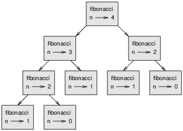

# 8.2 Dictionaries - Advanced Topics

Estimated Time: 40 Minutes

In this section, you will learn more about dictionaries and some prooblem solving with dicts.

## Item Lookup
Given a dictionary d and a key k, it is easy to find the corresponding value v = d[k]. This operation is called a lookup.

But what if you have v and you want to find k? You have two problems: first, there might be more than one key that maps to the value v. Depending on the application, you might be able to pick one, or you might have to make a list that contains all of them. Second, there is no simple syntax to do a reverse lookup; you have to search.

Here is a function that takes a value and returns the first key that maps to that value:
```
def reverse_lookup(d, v):
    for k in d:
        if d[k] == v:
            return k
    raise LookupError()
```

This function is yet another example of the search pattern, but it uses a feature we haven’t seen before, raise. The raise statement causes an exception; in this case it causes a LookupError, which is a built-in exception used to indicate that a lookup operation failed.

If we get to the end of the loop, that means v doesn’t appear in the dictionary as a value, so we raise an exception.

Here is an example of a successful reverse lookup:
```
>>> h = histogram('parrot')
>>> key = reverse_lookup(h, 2)
>>> key
'r'
```
And an unsuccessful one:
```
>>> key = reverse_lookup(h, 3)
Traceback (most recent call last):
  File "<stdin>", line 1, in <module>
  File "<stdin>", line 5, in reverse_lookup
LookupError
```

The effect when you raise an exception is the same as when Python raises one: it prints a traceback and an error message.

When you raise an exception, you can provide a detailed error message as an optional argument. For example:
```
>>> raise LookupError('value does not appear in the dictionary')
Traceback (most recent call last):
  File "<stdin>", line 1, in ?
LookupError: value does not appear in the dictionary
```
A reverse lookup is much slower than a forward lookup; if you have to do it often, or if the dictionary gets big, the performance of your program will suffer.

> **_NOTE:_** Rasing Exceptions and handling them was scanned here quickly. This topic will be covered in more detail at Programming 2

## Fibonacci  
Fibonacci is a mathematical function that has the following definition: https://en.wikipedia.org/wiki/Fibonacci_number

One implementation of this function in python would be:
```
def PrintFibonacci(length):
    #Initial variable for the base case. 
    first = 0
    second = 1

    #Printing the initial Fibonacci number.
    print(first, second, end=" ")

    #decreasing the length by two because the first 2 Fibonacci numbers 
    #already printed.
    length -= 2
    
    #Loop until the length becomes 0.
    while length > 0:

        #Printing the next Fibonacci number.
        print(first + second, end=" ")

        #Updating the first and second variables for finding the next number. 
        temp = second
        second = first + second
        first = temp

        #Decreasing the length that states the Fibonacci numbers to be 
        #printed more.
        length -= 1

if __name__ == "__main__":
    print("Fibonacci Series - ")
    PrintFibonacci(7)
    pass
```

Output for 7:
```
Fibonacci Series - 
1 1 2 3 5 8
```

We might notice here that the bigger argument you provide, the longer the function takes to run. Furthermore, the run time increases quickly. Let us take a closer look.



The figure above shows fibonacci with input of 4. A call graph shows a set of function frames, with lines connecting each frame to the frames of the functions it calls. At the top of the graph, fibonacci with n=4 calls fibonacci with n=3 and n=2. In turn, fibonacci with n=3 calls fibonacci with n=2 and n=1. And so on.

Count how many times fibonacci(0) and fibonacci(1) are called. This is an inefficient solution to the problem, and it gets worse as the argument gets bigger.

One solution is to keep track of values that have already been computed by storing them in a dictionary. A previously computed value that is stored for later use is called a memo. Here is a “memoized” version of fibonacci:

```
known = {0:0, 1:1}

def fibonacci(n):
    if n in known:
        return known[n]

    res = fibonacci(n-1) + fibonacci(n-2)
    known[n] = res
    return res
```

known is a dictionary that keeps track of the Fibonacci numbers we already know. It starts with two items: 0 maps to 0 and 1 maps to 1.

Whenever fibonacci is called, it checks known. If the result is already there, it can return immediately. Otherwise it has to compute the new value, add it to the dictionary, and return it.

If you run this version of fibonacci and compare it with the original, you will find that it is much faster.

> **_NOTE:_** Calling a function from itself is called recursion. This is a topic that we will talk about in Programming 2 in more detail