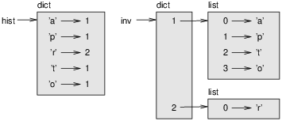

# 8.3 Dictionaries & Lists

In this section, we will check relations between dictionaries and lists

## Dictionaries & Lists - Lookup Time Perspective
A recall from previous lessons:
### Lists
Lists are one of the most commonly used data types in Python. A list is a sequence of items in an order.

`list1 = [4, 0.22, “Hello”, [1, 2, 3], -2.5, 0.22]`

Lists are mutable, they can be changed after they are created.

### Dictionaries
Dictionaries are unordered collections of key-value pairs, or items.

`dict1 = {key1: value1, key2: value2, key3: value3}`

Dictionaries are also mutable, we can add, remove, and/or change items as needed.

### Time
Imagine that you are asked to organise an event with lots of attendees. What would you use to save names? A list or a dict? And Why?
To have a proper answer for this question, please check the following article: https://towardsdatascience.com/faster-lookups-in-python-1d7503e9cd38

## Dictionaries & Lists - Hashable Perspective
Lists can appear as values in a dictionary. For example, if you are given a dictionary that maps from letters to frequencies, you might want to invert it; that is, create a dictionary that maps from frequencies to letters. Since there might be several letters with the same frequency, each value in the inverted dictionary should be a list of letters.

Here is a function that inverts a dictionary:
```
def invert_dict(d):
    inverse = dict()
    for key in d:
        val = d[key]
        if val not in inverse:
            inverse[val] = [key]
        else:
            inverse[val].append(key)
    return inverse
Each time through the loop, key gets a key from d and val gets the corresponding value. If val is not in inverse, that means we haven’t seen it before, so we create a new item and initialize it with a singleton (a list that contains a single element). Otherwise we have seen this value before, so we append the corresponding key to the list.
```
Here is an example:

```
>>> hist = histogram('parrot')
>>> hist
{'a': 1, 'p': 1, 'r': 2, 't': 1, 'o': 1}
>>> inverse = invert_dict(hist)
>>> inverse
{1: ['a', 'p', 't', 'o'], 2: ['r']}
```



The figure above is a state diagram showing hist and inverse. A dictionary is represented as a box with the type dict above it and the key-value pairs inside. If the values are integers, floats or strings, I draw them inside the box, but I usually draw lists outside the box, just to keep the diagram simple.

Lists can be values in a dictionary, as this example shows, but they cannot be keys. Here’s what happens if you try:
```
>>> t = [1, 2, 3]
>>> d = dict()
>>> d[t] = 'oops'
Traceback (most recent call last):
  File "<stdin>", line 1, in ?
TypeError: list objects are unhashable
```

A dictionary is implemented using a hashtable and that means that the keys have to be hashable. A hash is a function that takes a value (of any kind) and returns an integer. Dictionaries use these integers, called hash values, to store and look up key-value pairs.

This system works fine if the keys are immutable. But if the keys are mutable, like lists, bad things happen. For example, when you create a key-value pair, Python hashes the key and stores it in the corresponding location. If you modify the key and then hash it again, it would go to a different location. In that case you might have two entries for the same key, or you might not be able to find a key. Either way, the dictionary wouldn’t work correctly.

That’s why keys have to be hashable, and why mutable types like lists aren’t. The simplest way to get around this limitation is to use tuples, which we will see in the next chapter.

Since dictionaries are mutable, they can’t be used as keys, but they can be used as values.