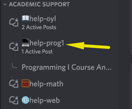

# Midterm Project

**Due Date - Nov 13**

---

> 👥 This is a team project. Pair up with a small team (2-4 students) to work with you.
> If you have trouble collaborating, or get stuck on the project, use the **#help-prog1** channel in Discord or message an instructor.
>
> 

## 🤖 Team Info Bot

This is your chance to be creative with your team. You can make a really fun and funny project together that meets all the requirements.

**Access** the assignment here: https://github.com/kiboschool/chatbot

Remember...

- **Read** the instructions
- **Plan** before you code
- **Debug** if you aren't getting the desired output
- **Attend** office hours if you need additional support
- **Ask** for help in Discord
